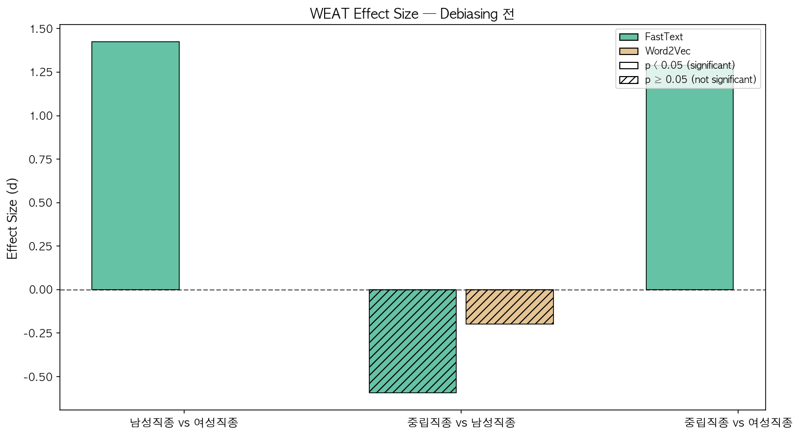
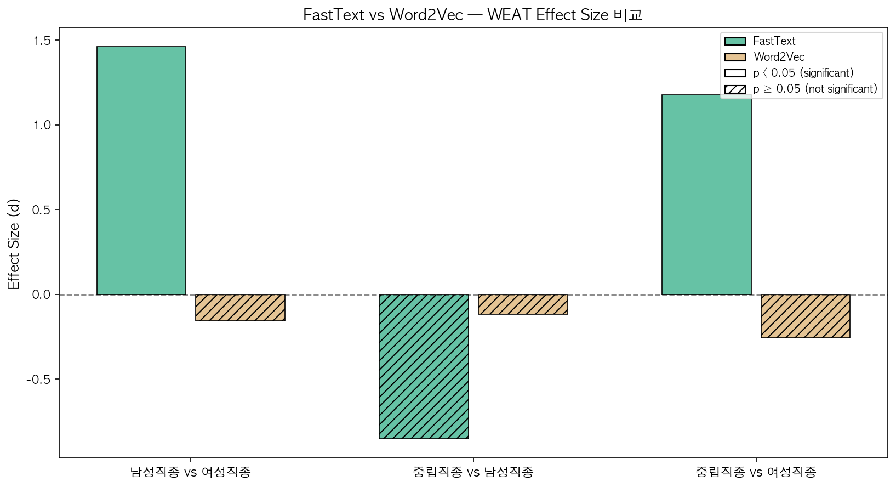
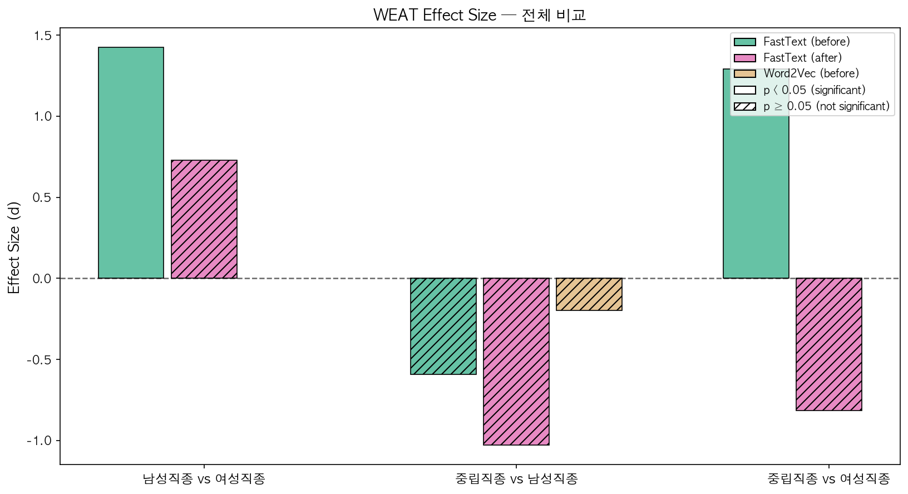
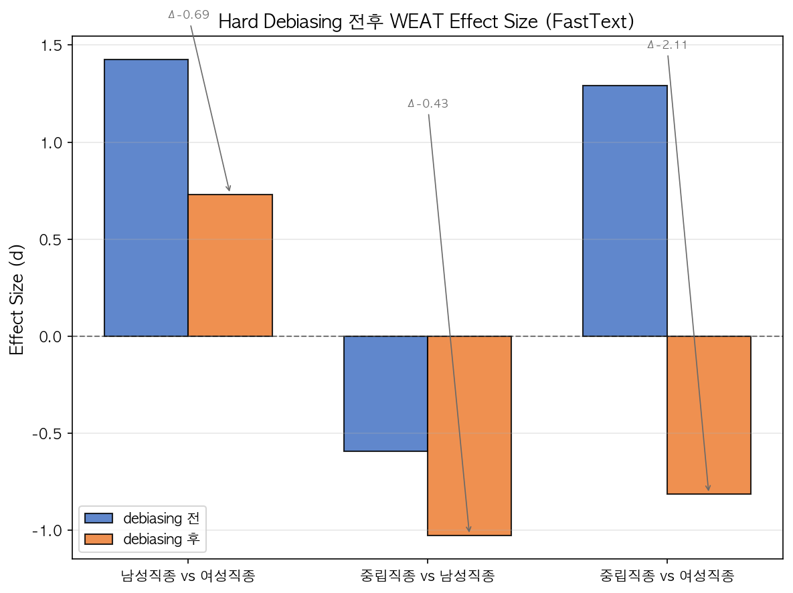
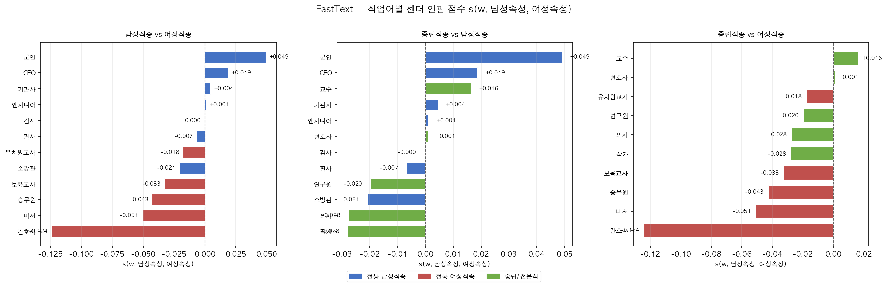
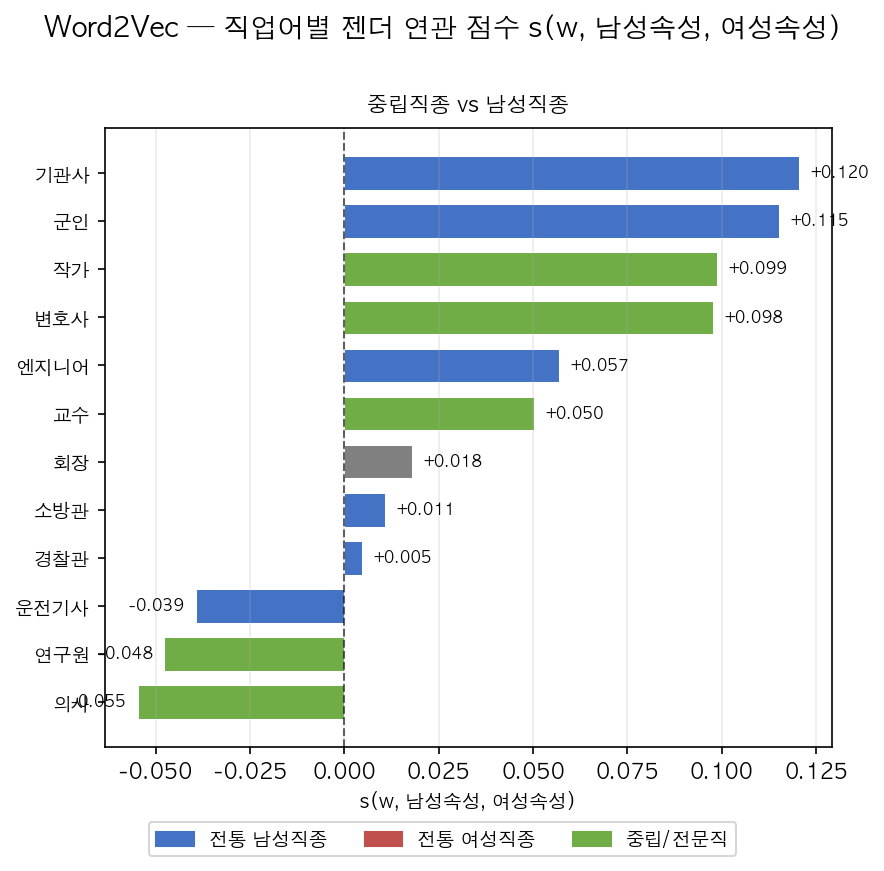
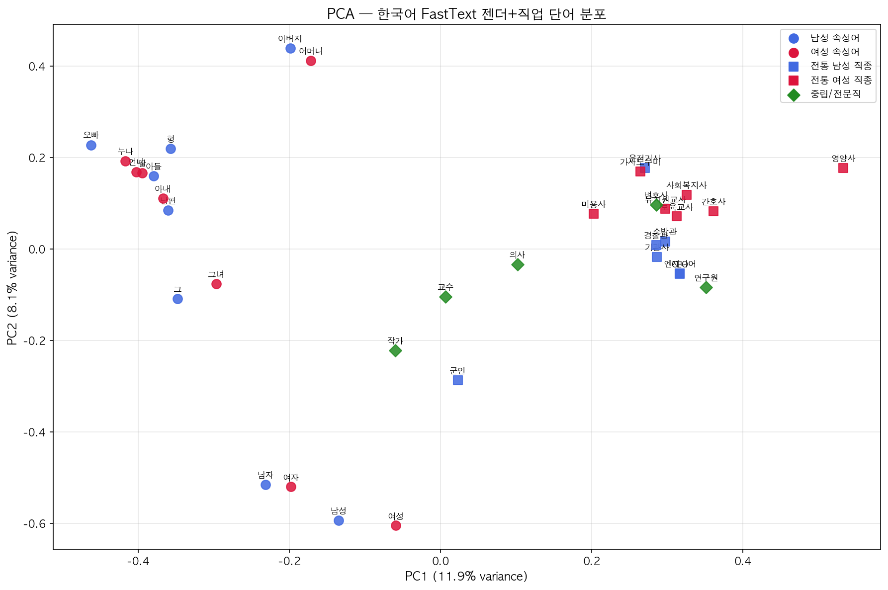
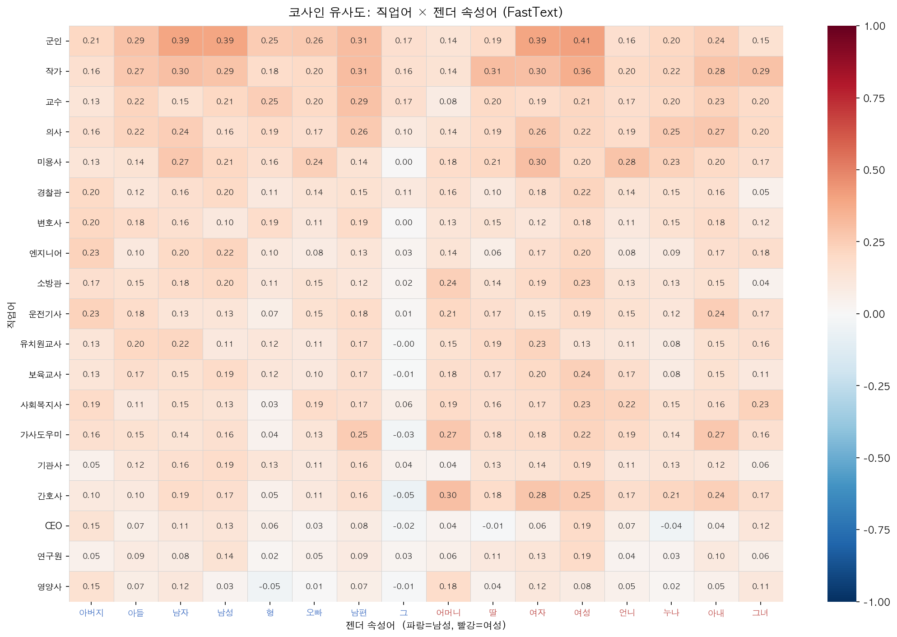

# Korean Word Embedding Gender Bias — WEAT Analysis

> **한국어 단어 임베딩의 젠더 편향 측정 및 완화**  
> Measuring and mitigating gender bias in Korean pre-trained word embeddings via WEAT

---

## Overview

This project quantifies gender-occupational bias in Korean pre-trained word embeddings (FastText, Word2Vec) using the **Word Embedding Association Test (WEAT)** framework (Caliskan et al., 2017), then applies **hard debiasing** (Bolukbasi et al., 2016) and measures its effect.

Most prior WEAT research targets English embeddings. Korean's agglutinative morphology and distinct socio-cultural gender norms require independent analysis. This project provides:

- A Korean-specific gender–occupation stimulus word set grounded in Korean social context
- A full WEAT pipeline with permutation testing (10,000 iterations)
- Before/after hard debiasing comparison with effect size and significance analysis
- Word2Vec cross-validation for robustness check
- Per-word association score visualization revealing which occupations are most gender-coded
- Visualizations: PCA scatter, cosine heatmap, effect size bar charts, debiasing comparison

---

## Key Results

### FastText (cc.ko.300) — Primary Analysis

| Test | Effect Size (d) | p-value | Significant |
|---|---|---|---|
| 전통 남성직종 vs 여성직종 | **+1.46** | 0.003 | ✅ |
| 중립/전문직 vs 여성직종 | **+1.18** | 0.022 | ✅ |
| 중립/전문직 vs 남성직종 | −0.85 | 0.925 | ❌ |

> d > 0 = target set X more associated with male attributes. |d| > 0.8 = large effect (Cohen's convention).

**After hard debiasing:**

| Test | Before | After | Δ |
|---|---|---|---|
| 전통 남성직종 vs 여성직종 | +1.46 ✅ | +0.47 ❌ | −0.99 |
| 중립/전문직 vs 남성직종 | −0.85 ❌ | −1.23 ❌ | −0.38 |
| 중립/전문직 vs 여성직종 | +1.18 ✅ | **−1.01** ❌ | **−2.18** |

The third test shows a **sign reversal** (overcorrection): hard debiasing distorts the semantic structure of occupation vectors beyond the intended correction.

### Word2Vec (Kyubyong/wordvectors) — Cross-Validation

| Test | Effect Size (d) | p-value | Significant |
|---|---|---|---|
| 전통 남성직종 vs 여성직종 | −0.16 | 0.599 | ❌ |
| 중립/전문직 vs 남성직종 | −0.12 | 0.566 | ❌ |
| 중립/전문직 vs 여성직종 | −0.26 | 0.644 | ❌ |

Word2Vec shows no statistically significant bias. Two factors likely explain the divergence from FastText: (1) **corpus difference** — FastText trained on CC-100 web crawl (social media, forums) vs. Word2Vec on Wikipedia/Namuwiki (encyclopedic text); (2) **alias substitution** — OOV compound nouns `보육교사`→`교사`, `유치원교사`→`선생님`, `CEO`→`회장` introduced more gender-neutral terms, diluting expected female associations.

### Key Findings

1. **Gender-occupational bias confirmed in FastText**: Traditional male-coded occupations (군인, 소방관, 판사, 엔지니어…) are strongly associated with male attributes (d = 1.46, p = 0.003).
2. **Male default for expertise**: Neutral/professional occupations (의사, 교수, 변호사…) are more male-associated than female-coded occupations (d = 1.18, p = 0.022) — suggesting a structural male default for expertise in Korean web-crawled text.
3. **Hard debiasing overcorrects**: Statistical significance is removed across all tests, but the neutral-vs-female test reverses sign (Δ = −2.18), indicating semantic distortion.
4. **Corpus matters more than model architecture**: The FastText/Word2Vec divergence suggests training data social context is the primary driver of bias strength.

---

## Figures

### WEAT Effect Size (FastText — before debiasing)


### FastText vs Word2Vec Cross-Model Comparison


### FastText Before/After Debiasing + Word2Vec


### Hard Debiasing Before vs. After


### Per-Word Association Scores — FastText


### Per-Word Association Scores — Word2Vec


### PCA: Gender + Occupation Word Distribution


### Cosine Similarity Heatmap (Occupations × Gender Attributes)


---

## Method

### Word Sets

**Gender attributes:**
- Male: 아버지, 아들, 남자, 남성, 형, 오빠, 남편, 그
- Female: 어머니, 딸, 여자, 여성, 언니, 누나, 아내, 그녀

**Occupation targets (Korean-context design):**
- Traditional male: 군인, 소방관, 기관사, 판사, 검사, 엔지니어, CEO
- Traditional female: 간호사, 보육교사, 유치원교사, 비서, 승무원
- Neutral/professional: 의사, 교수, 변호사, 연구원, 작가

### WEAT Effect Size

```
s(w, A, B) = (1/|A|) Σ cos(w,a) - (1/|B|) Σ cos(w,b)
d = (mean_{x∈X} s(x,A,B) - mean_{y∈Y} s(y,A,B)) / std_{z∈X∪Y} s(z,A,B)
```

Means are computed independently for A and B to handle unequal set sizes after OOV filtering.  
Statistical significance via one-sided permutation test (10,000 iterations).

### Hard Debiasing (Bolukbasi et al., 2016)

1. Compute gender direction **g** via PCA on male–female difference vectors (L2-normalized)
2. **Neutralize**: remove gender component from occupation word vectors: v′ = v − (v·g)g
3. **Equalize**: make gender word pairs equidistant from the gender axis midpoint

---

## Embedding Models

| Model | Source | Dim | Training Corpus | Notes |
|---|---|---|---|---|
| Korean FastText | [fasttext.cc](https://fasttext.cc/docs/en/crawl-vectors.html) | 300 | CC-100 web crawl | Subword OOV handling; primary analysis |
| Korean Word2Vec | [Kyubyong/wordvectors](https://github.com/Kyubyong/wordvectors) | 200 | Wikipedia + Namuwiki | Cross-validation; OOV words resolved via aliases |

Download FastText (≈4.2 GB):
```bash
bash setup.sh
```

---

## Limitations

- **Static embeddings**: Polysemous words (`그` = he/that; `의사` = doctor/intent/martyr) have a single averaged vector — contextual sense disambiguation is lost.
- **Alias substitution in Word2Vec**: OOV compound nouns were replaced with gender-neutral aliases (`보육교사`→`교사`, `유치원교사`→`선생님`), likely diluting female-occupation association. This is a methodological caveat for the cross-validation comparison.
- **Stimulus word selection bias**: Occupation lists reflect researcher judgment. Survey-based validation was not performed.
- **Hard debiasing overcorrection**: Sign reversal in the neutral-vs-female test (Δ = −2.18) indicates semantic distortion beyond gender removal. Softer alternatives (INLP, Ravfogel et al., 2020) may be preferable.
- **Scope**: Static (non-contextual) embeddings only. Contextual bias in KoBERT, EXAONE, etc. is out of scope.

---

## Repo Structure

```
├── src/
│   ├── word_sets.py        # Korean WEAT stimulus word sets + OOV aliases
│   ├── weat.py             # WEAT calculation + permutation test
│   ├── load_embeddings.py  # Model loading (FastText + Word2Vec)
│   ├── debiasing.py        # Hard debiasing (neutralize + equalize)
│   └── visualize.py        # All visualizations + CSV export
├── notebooks/
│   └── analysis.ipynb      # Full narrative analysis (executed)
├── tests/                  # 47 unit tests — no model files required
├── results/
│   ├── figures/            # 8 PNG outputs
│   └── csv/                # WEAT result tables (FastText before/after, Word2Vec)
├── run_analysis.py         # Headless script entrypoint
├── setup.sh                # Dependency install + model download
└── conftest.py             # pytest path setup
```

## Quickstart

```bash
# 1. Install dependencies + download FastText model (~4.2 GB)
bash setup.sh

# 2. (Optional) Place Korean Word2Vec at models/ko.bin
#    https://github.com/Kyubyong/wordvectors

# 3. Run notebook
jupyter notebook notebooks/analysis.ipynb

# 4. Or headless
python run_analysis.py --fasttext-path models/cc.ko.300.bin
python run_analysis.py --fasttext-path models/cc.ko.300.bin --word2vec-path models/ko.bin
```

```bash
# Unit tests (no model required)
pytest tests/ -v   # 47 tests
```

---

## References

- Caliskan, A., Bryson, J. J., & Narayanan, A. (2017). Semantics derived automatically from language corpora contain human-like biases. *Science*, 356(6334), 183–186.
- Bolukbasi, T., Chang, K.-W., Zou, J., Saligrama, V., & Kalai, A. (2016). Man is to computer programmer as woman is to homemaker? Debiasing word embeddings. *NeurIPS*.
- Ravfogel, S. et al. (2020). Null it out: Guarding protected attributes by iterative nullspace projection. *ACL*.
- Ko, W. et al. (2023). KoBBQ: Korean Bias Benchmark for Question Answering. *ACL Findings*.
- Bender, E. M. et al. (2021). On the dangers of stochastic parrots. *FAccT*.
